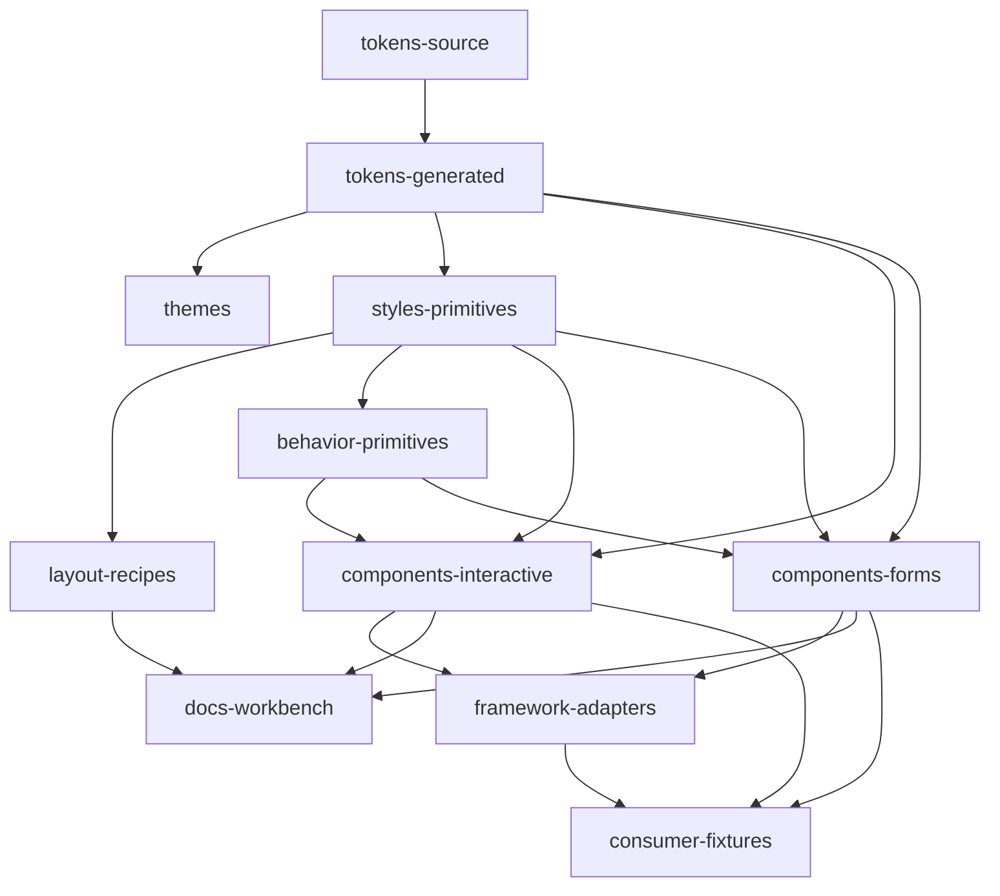

# Cross-Project Web Component Framework Architecture Recommendation

## 1. System context

- Purpose: Provide a cross-project component system that exposes the smallest durable browser-level contract while separating behavior from visual identity.
- Intended consumers:
  - plain HTML and ES modules,
  - static and Markdown-generated sites,
  - documentation sites,
  - React applications,
  - Vue applications,
  - server-rendered environments after fixture validation.
- Non-goals:
  - replacing semantic HTML wholesale,
  - hiding unresolved product semantics behind generic "card" components,
  - creating a single synchronized mega-package,
  - promising universal SSR before fixtures pass.
- Trust boundaries:
  - core behavior must not assume framework presence,
  - consumer styling may customize documented tokens, parts, and CSS vars only,
  - undocumented DOM and selectors are private.

## 2. Layer model

1. Web platform layer: HTML, ARIA, DOM, forms, CSS custom properties, cascade layers, container queries.
2. Authoring/runtime layer: native `HTMLElement`, utilities, and Lit for bounded interactive packages.
3. Behavioral primitives: focus management, roving tabindex, overlay positioning, state controllers.
4. Accessible interactive components: widgets with explicit keyboard and accessibility contracts.
5. Form controls: selected controls using native inputs or approved form-associated CEs.
6. Layout/composition: CSS-first recipes and utilities.
7. Tokens: DTCG source plus generated CSS/TS artifacts.
8. Themes: brand and context mappings over semantic tokens.
9. Documentation and examples: Storybook, authored guides, generated API docs.
10. Framework adapters: optional React/Vue wrappers.
11. Testing and release tooling: Playwright, unit tests, API diffing, changesets.
12. Project extensions: local packages in consuming repos, never imported back into core.

## 3. Dependency rules



- Illegal dependencies:
  - components -> project extensions
  - core packages -> Storybook-only utilities
  - behavior primitives -> framework adapters
  - tokens source -> component packages

## 4. Proposed repository layout

```text
web-components/
  packages/
    tokens/
    themes/
    styles/
    behavior/
    layout/
    components/
      button/
      disclosure/
      field-text/
      record/
    adapters/
      react/
      vue/
    testing/
  docs/
    storybook/
    authored-guides/
  fixtures/
    html/
    react/
    vue/
    ssr/
  tooling/
    build/
    release/
    lint/
    codemods/
  experiments/
  .changeset/
```

## 5. Package map

- `@ve/tokens`: canonical generated token artifacts; no runtime side effects.
- `@ve/themes-*`: theme mappings and brand layers.
- `@ve/styles`: global CSS primitives, cascade layers, resets only if documented.
- `@ve/behavior`: framework-agnostic behavior helpers and controllers.
- `@ve/layout`: CSS-first composition recipes and optional helper classes.
- `@ve/<component>`: per-component packages for interactive or form components.
- `@ve/react`: optional React adapters.
- `@ve/vue`: optional Vue adapters.
- `@ve/testing`: test helpers, fixture assertions, axe/playwright helpers.

## 6. Component taxonomy

- Native HTML recipes:
  - default architecture: docs + CSS + usage guidance.
  - required tests: docs examples, accessibility guidance, visual spot checks.
- CSS/layout primitives:
  - default architecture: CSS-first recipes.
  - required tests: responsive, logical properties, container-query checks.
- Behavioral primitives:
  - default architecture: DOM utilities/controllers.
  - required tests: unit + browser interaction.
- Interactive components:
  - default architecture: CE, usually Lit, often Shadow DOM.
  - required tests: keyboard, a11y, event contract, visual regression.
- Form-associated controls:
  - default architecture: native-first, CE only by exception.
  - required tests: form submit, reset, validity, labels, errors.
- Semantic composites:
  - default architecture: Light DOM, slots/regions, open structure.
  - required tests: semantics, slot/content, theme openness.
- Experimental components:
  - isolated package path, prerelease channel only.

## 7. Styling and theming contract

- Token flow:
  - DTCG source -> generated semantic CSS custom properties -> theme mappings -> component consumption.
- Policy:
  - prefer semantic tokens over component-specific tokens,
  - expose minimal component-local CSS vars,
  - expose CSS parts only for stable, intentional styling hooks,
  - no undocumented selectors as public API.
- DOM policy:
  - Light DOM components inherit typography and composition naturally.
  - Shadow DOM components consume tokens and expose narrow public hooks.
- Accessibility overrides:
  - forced colors, reduced motion, contrast modes, and user overrides must layer above theme defaults.

## 8. Public API rules

- Element names:
  - stable prefix such as `ve-`.
- Attributes:
  - only for string, numeric, and boolean HTML-facing configuration.
- Properties:
  - use for structured data and complex state.
- Events:
  - lowercase/kebab-case custom event names,
  - `bubbles: true`, `composed: true` for consumer-facing events unless there is a documented reason not to.
- Methods:
  - only for imperative actions with no better declarative form.
- Deprecation:
  - mark in source annotations, docs, CEM, changelog, and migration notes.

## 9. Integration model

- Plain HTML:
  - first-class baseline.
- TypeScript:
  - ship declarations for all public packages.
- React:
  - support direct CE usage; publish wrappers only where typing/event ergonomics warrant it.
- Vue:
  - support direct CE usage; wrappers optional.
- Static/Markdown-generated sites:
  - allow progressive enhancement and selective JS loading.
- SSR:
  - supported only after chosen strategy passes html/react/vue/ssr fixtures.

## 10. Documentation architecture

- Authored:
  - architectural guides, accessibility contracts, migration guides, usage recipes.
- Generated:
  - CEM-derived API docs, prop/event tables, search indexes, package catalogs.
- Primary workbench:
  - Storybook.
- Canonical contract:
  - source + CEM + tests, not Storybook stories alone.

## 11. Test architecture

- Static layers:
  - type check, lint, API lint, token lint.
- Browser layers:
  - Playwright interaction, keyboard, accessibility, visual regression.
- Consumer fixtures:
  - plain HTML, React, Vue, SSR where applicable.
- Release gates:
  - build,
  - CEM generation,
  - export validation,
  - browser tests,
  - fixture tests,
  - docs build.

## 12. Release and update model

- Monorepo with publishable packages.
- Changesets for release orchestration.
- Independent versions allowed, with lockstep-major discipline until maturity.
- Experimental packages publish to prerelease channels only.
- Every breaking change requires migration notes and compatibility test updates.

## 13. Governance

- New component proposal must include:
  - use case,
  - category,
  - semantic boundary,
  - accessibility contract,
  - token/styling contract,
  - test plan,
  - evidence of repeated need.
- Graduation from experimental requires:
  - two consumer contexts,
  - full docs,
  - stable CEM contract,
  - accessibility review,
  - API review.

## 14. Adoption strategy

- First pilots:
  - one native recipe,
  - one interactive disclosure,
  - one form field if FAE validation passes,
  - one CSS layout primitive,
  - one token/theme demo.
- Success metrics:
  - direct HTML consumption,
  - React and Vue fixture success,
  - clear styling boundaries,
  - no undocumented selector dependencies,
  - passing browser/a11y tests.

